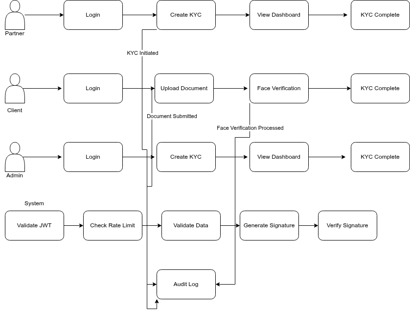

# kyc-platform

This is a Django-based API designed for KYC and electronic signature to enforce numeric trust as part of the Westaf Digital Services interview process

# Installation

```bash
$ git clone git@github.com:Eddy-123/kyc-platform.git

$ cd kyc-platform

$ docker compose up --build
```

You can now use the api according to Postman documentation.

# Sample data

To create a superuser/admin, you can run the following:

```bash
$ docker compose run web python manage.py createsuperuser
```

In order to have other users, you can run these commands:

```bash
$ docker compose run web python manage.py shell

>>> from django.contrib.auth import get_user_model

>>> User = get_user_model()

>>> partner = User.objects.create_user(username='partner', email='partner@wds.com', password='p@ssw0rd')

>>> partner.role = User.Roles.PARTNER

>>> partner.save()

>>> client = User.objects.create_user(username='client', email='client@wds.com', password='p@ssw0rd')

>>> client.role = User.Roles.CLIENT
>>> client.save()

```

# Architecture

Our users are either `Partner`, `Client` or `Admin`

The role of each of them is represented in this schema:



A system-focused interaction among them is represented here:


