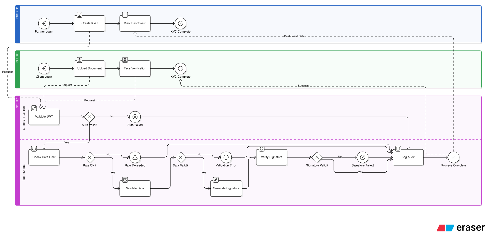
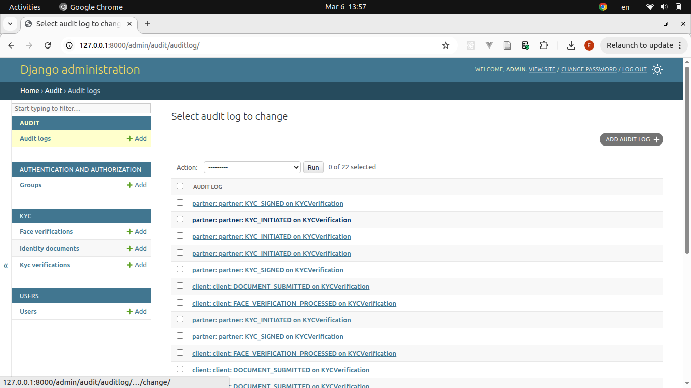

# kyc-platform

This is a Django-based API designed for KYC and electronic signature to enforce numeric trust as part of the Westaf Digital Services interview process

# Installation

```bash
$ git clone git@github.com:Eddy-123/kyc-platform.git

$ cd kyc-platform

$ cp .env.example .env

$ cp received_private_key.pem keys/private_key.pem # replace received_private_key.pem by the location of the private key sent by email

$ docker compose up --build
```

You can now use the api according to Postman documentation.

# Sample data

To create a superuser/admin, you can run the following:

```bash
$ docker compose run web python manage.py createsuperuser
```

In order to have other users, you can run these commands:

```bash
$ docker compose run web python manage.py shell

>>> from django.contrib.auth import get_user_model

>>> User = get_user_model()

>>> partner = User.objects.create_user(username='partner', email='partner@wds.com', password='p@ssw0rd')

>>> partner.role = User.Roles.PARTNER

>>> partner.save()

>>> client = User.objects.create_user(username='client', email='client@wds.com', password='p@ssw0rd')

>>> client.role = User.Roles.CLIENT
>>> client.save()

```

# Architecture

Our users are either `Partner`, `Client` or `Admin`

The role of each of them is represented in this schema:


A system-focused interaction among them is represented here:



You can locally access Django admin space here:

[http://127.0.0.1:8000/admin/](http://127.0.0.1:8000/admin/)

The admin can access audit logs of the whole system:



You can find the postman doc [here](schema/WDS.postman_collection.json) and in the email submitted for the project.

Django enables rapid, secure, and maintainable development, making it ideal for a KYC system with JWT authentication and RSA signatures.

RSA signatures are used because asymmetric cryptography allows secure signing and verification without exposing private keys.

PostgreSQL is used because it is a relational database that enforces relationships between models.

# KYC lifecycle

- Create KYC
  - actor: Partner
- Upload document
  - actor: Client
- Face verification
  - actor: Client
- Signature generation
  - Anyone authenticated
- Signature verification
  - Anyone authenticated

# Technical requirements

- JWT authentication
- RSA signature
- Rate limiting: 100/hour
- Data validation with serializers: DocumentUploadSerializer for example
- Logging system with audit application
- Error handling with Exceptions and serializers
- Tests: state_machine in kyc app and AuditLog model
- Request to demonstrate extra care to performance
  - partners/me/kyc-dashboard
  - send dashboard data of a partner related KYC
  - .aggregate() combines everything into one sql request
  - .select_related() and .prefetch_related() avoid N+1 query problem
  - [:10] prevents from fetching useless data
  - db indexes in models
